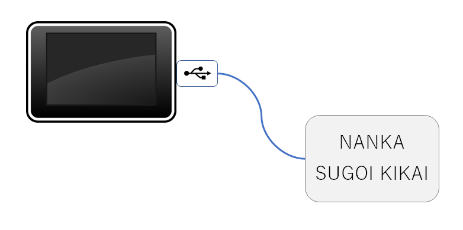
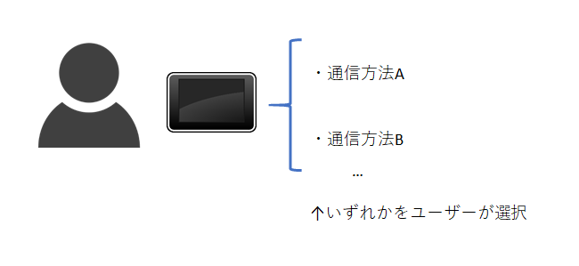
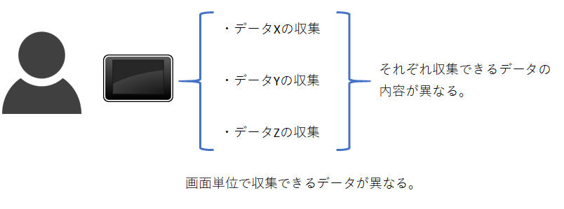
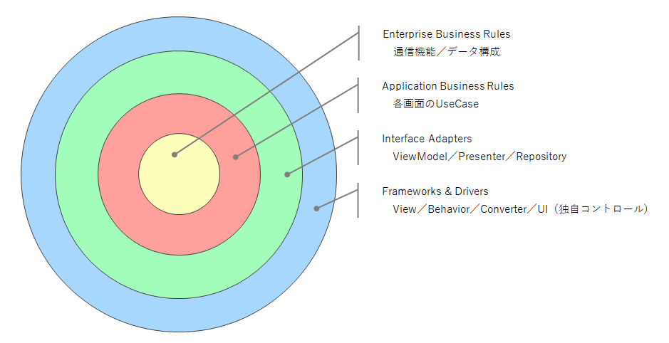

# CleanArchitecture.Example
Clean Architecture + MVVM を使用したWPF のサンプルプロジェクトです。

# 概要  
このリポジトリはWPF でClean Architecture とMVVM を使用するためのサンプルとして作成されました。  

## システム構成  
このサンプルでは以下のようなシステム構成を想定しています。  

Windows タブレットでUSB 有線で何らかの機器（以下"通信機器"とします）と接続します。  
通信機器とタブレットはあるプロトコルによってセキュアなデータの通信を実行することが可能です。  
通信プロトコルは複数種類あり、ユーザーはタブレットでどちらの方法で通信するかを選択できるものとします。  
各プロトコルはデータ構成、シーケンスが全く異なります。  
取得するデータは複数種類あり、ユーザーはそれを選択可能であるものとします。　　

通信機器からデータを取得すると、その結果をローカルストレージのログファイルに保存します。  
ログファイルに関する仕様は今回割愛するものとします。ひとまずファイルに出力できればOK だと考えてください。

## 開発環境  
* OS : Windows 10
* 開発環境 : Visual Studio 2017 Comunity
* 言語 : C#
* GUI アーキテクチャ : WPF
* Framework : .NET Framework 4.7.2, .NET Standard 1.3
* その他 : Prism(MVVM インフラストラクチャ), Material Design In XAML(テーマ), xUnit(ユニットテストのインフラストラクチャ)

## 各レイヤーの責務  
クリーンアーキテクチャにおける各レイヤーの責務をいかに示します。  
今回はサンプルなのでざっくりこんな感じで考えました。  
